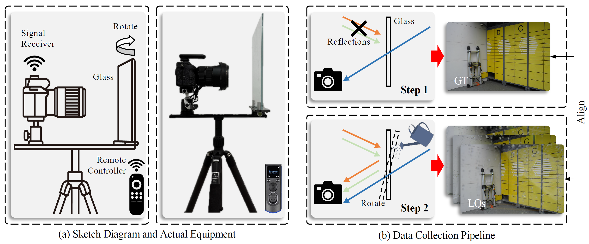
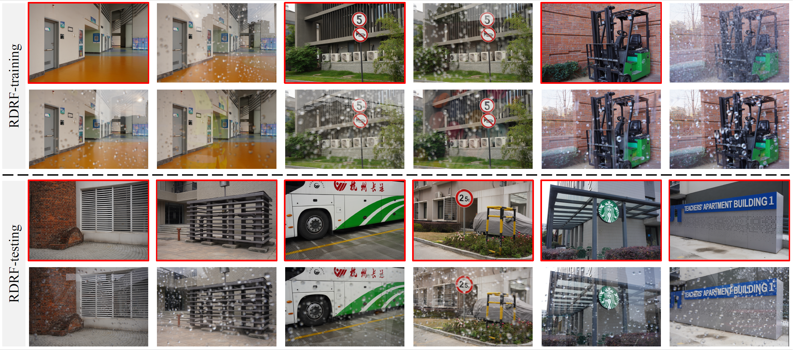

# RDRF-dataset @ ECCV'2026
<p align="justify">
  <a href="https://arxiv.org/abs/2603.16446">
    
  </a>
  <!-- <a href="https://xingyuliu00.github.io/diffur3/">
    
  </a> -->
</p>

## 📣📣📣 News
- `[2026-07-02]` Dataset page is online.
- `[2026-06-18]` Our paper is accepted by ECCV'2026.
- `[2026-05-27]` [The Challenge on Unified Removal of Raindrops and Reflections](https://www.codabench.org/competitions/16629/) is organized in conjunction with the [LoViF 2026 workshop](https://lovif-eccv2026-workshop.github.io/) at ECCV 2026.

## 📝 TODO

- [ ] Release RDRF-wild dataset.

<!-- ##  News

- `[2026-07-03]` RDRF-training and RDRF-testing are released.
- `[2026-07-02]` Dataset page is online. -->

## Problem Definition
On rainy days, raindrops and reflections frequently co-occur in autonomous driving scenarios, posing challenges for onboard visual recognition systems or vehicle cameras during recording. 
Adherent raindrops and the reflections from camera side significantly reduce the visibility of captured images, and may lead to severe driving safety hazards. 
Therefore, Unified Removal of Raindrops and Reflections (UR$^3$) is a practical problem that requires urgent solution.

## How we capture the images
Our RDRF dataset is captured under real scenarios deliberately constructed in controlled environments.
For the hardware configuration, the camera is mounted on a tripod using an adjustable base, with the glass slab positioned in front of the lens.
We connect a signal receiver onto the camera, thereby enabling remote control of the shutter.
This wireless triggering mechanism can effectively avoid image misalignment caused by camera vibrations resulting from manual operation.
To ensure diversity, neither the camera nor the glass is fixed. 
They can be adjusted to simulate different shooting situations (\eg, camera-to-glass distances/angles).
In addition, we utilize two cameras (Sony ILCE-7RM4A and Nikon D7100) with zoom lens and choose different glass thicknesses (3 mm, 5 mm, and 8 mm) to further enhance diversity. 

<p align="left">
  
</p>

## Dataset Structure
In the training and testing subsets, each ground truth image may correspond to multiple degraded images with different raindrop and reflection degradation patterns. The dataset is organized as follows:

```text
RDRF-training/
├── input/
│   ├── 001-001.png
│   ├── 001-002.png
│   ├── ...
│   ├── 002-001.png
│   ├── 002-002.png
│   ├── ...
│   ├── 003-001.png
│   └── ...
└── gt/
    ├── 001.png
    ├── 002.png
    ├── 003.png
    └── ...

RDRF-testing/
├── input/
│   ├── 001-001.png
│   ├── 001-002.png
│   ├── ...
│   ├── 002-001.png
│   ├── 002-002.png
│   ├── ...
│   ├── 003-001.png
│   └── ...
└── gt/
    ├── 001.png
    ├── 002.png
    ├── 003.png
    └── ...
```

The file names indicate the correspondence between degraded images and ground truth images. For example, `001-001.png`, `001-002.png`, and `001-003.png` correspond to the same ground truth image `001.png`, but contain different raindrop and reflection degradation patterns. All images are provided at a resolution of 1080 × 720.

## Some Samples
<p align="left">
  
</p>

## Download

### Train & Test Data

| Dataset | Google Drive | Baidu Disk |
| :--: | :--: | :--: |
| RDRF-training | [Download](https://drive.google.com/file/d/13r7TljW3kAYsEOBAIGsgX00SXJ5gDRBX/view?usp=sharing) | [Download](https://pan.baidu.com/s/1GAPlRvtrZtARnWgOxP-cyA?pwd=ecxa) `ecxa` |
| RDRF-testing | [Download](https://drive.google.com/file/d/1U_uVRfSjdOQMyPfeNQV_GOPfNCWBinrv/view?usp=sharing) | [Download](https://pan.baidu.com/s/1ES4y242PxLsIDBvu5Hveqw?pwd=3fs8) `3fs8` |

## About RDRF-wild

Coming soon.


<!-- ## Abstract @ ECCV’2026 -->

<!-- ## 📖 **Overview**  
PolarFree addresses the challenging task of reflection removal using polarization cues and a novel diffusion-based approach. Key contributions include:  
- **PolaRGB Dataset**: A large-scale dataset with diverse indoor and outdoor scenes, providing RGB and polarization images.  


- **Diffusion Model**: Utilizes diffusion processes to generate reflection-free priors, enabling precise reflection removal and improved image clarity.  


- **Superior Results**: Extensive experiments on the PolaRGB dataset show that PolarFree outperforms existing methods by ~2dB in PSNR, achieving cleaner reflection removal and sharper image details.  

- **Real-World Effectiveness**: PolarFree demonstrates robust performance in real-world scenarios, such as museums and galleries, effectively reducing reflections while preserving fine details.   -->


## Citation
If our RDRF dataset is useful for your research, please cite our paper.
```BibTeX
@inproceedings{Liu2026ECCV-RDRF,
  title={Unified Removal of Raindrops and Reflections: A New Benchmark and A Novel Pipeline},
  author={Xingyu Liu and Zewei He and Yu Chen and Chunyu Zhu and Zixuan Chen and Xing Luo and Zhe-Ming Lu},
  booktitle={European Conference on Computer Vision (ECCV)},
  year={2026}
}
```